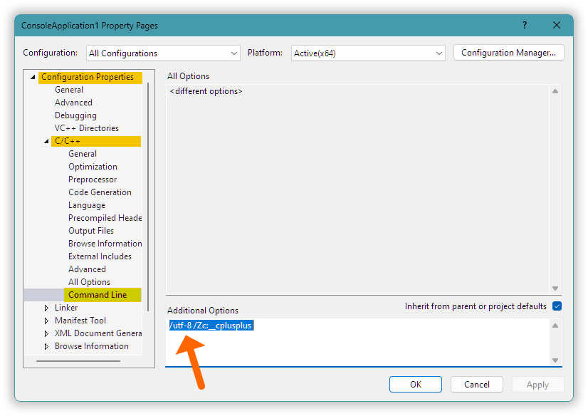
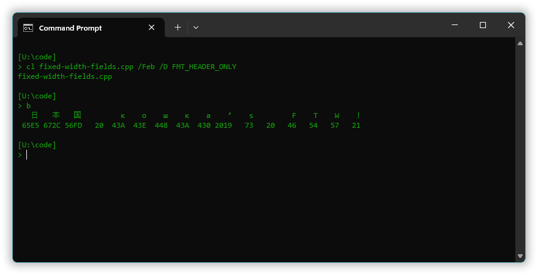

##  C++ *how* to &mdash; make non-English text work in Windows.

If special characters `ø`, `¿`, `á` or similars don’t display correctly then you’re probably using Windows.

Console input and output of non-English characters Just Works&trade; in \*nix environments because \*nix environments in practice use UTF-8 encoding for all text. Unfortunately that’s not so in Windows. In Windows you must *make it* work.

And it’s not just console i/o that’s problematic in Windows:

international characters in filesystem paths, or in environment variables, or in command line arguments, whatever, are problematic for portable `char`-based code in Windows, by default resulting in gobbledygook garbage and/or failed operations.

*Most of these problems can be fixed.*

<!-- START doctoc generated TOC please keep comment here to allow auto update -->
<!-- DON'T EDIT THIS SECTION, INSTEAD RE-RUN doctoc TO UPDATE -->
**Table of Contents**  *generated with [DocToc](https://github.com/thlorenz/doctoc)*

- [1. *How* to display non-English characters in the console.](#1-how-to-display-non-english-characters-in-the-console)
- [2. *How* to format fixed width fields (regardless of Windows/*nix/whatever platform).](#2-how-to-format-fixed-width-fields-regardless-of-windowsnixwhatever-platform)
- [3. *How* to input non-English characters from the console.](#3-how-to-input-non-english-characters-from-the-console)
- [4. *How* to get the `main` arguments UTF-8 encoded.](#4-how-to-get-the-main-arguments-utf-8-encoded)
- [5. *How* to make `std::filesystem::path` (do the) work.](#5-how-to-make-stdfilesystempath-do-the-work)

<!-- END doctoc generated TOC please keep comment here to allow auto update -->


### 1. *How* to display non-English characters in the console.

As of mid 2024 the common way to make Windows applications work well with international text is still to use the Windows API’s `wchar_t` based functionality. However such `wchar_t` based code using the Windows API is complex and works only in Windows. This *how to* is instead about the portable `char` based code common in book and tutorial examples, in portable libraries and programs, and in student work.

To make ordinary output via e.g. `cout` work in Windows you need to take control of four **text encodings** &mdash; how text is represented as a sequence of byte values:

1.    The encoding your editor saves source code files with.
2.    The encoding the compiler assumes for a source code file.
3.    The encoding the compiler uses to store `char` based literals.
4.    The encoding the console assumes for a program’s byte stream output.

To make classical file open functions work with international characters in file names, and to make the arguments of `main` work with international text, you additionally need to take control of

5.    The encoding that `char` based Windows API functions assume, called the process’ “ANSI” encoding.

The simplest is to set all these to UTF-8.

Taking care of (1), the source code’s encoding, depends on the editor you use. The editor’s functionality for that can be available via its “save as” dialog (Visual Studio), or e.g. as a conversion choice in the menus (Notepad++), or e.g. sort of hidden behind an encoding name in the status bar (Visual Studio Code). Anyway, don’t forget to do it!

With the g++ compiler (2) and (3) are already UTF-8 by default, so with g++ you only need to fix (4), the console’s encoding assumption, which you can do via a code snippet such as

```cpp
#ifdef _WIN32
    system( "chcp 65001 >nul" );        // Set the console to expect codepage 65001 = UTF-8.
#endif
```

Here `_WIN32` is a macro that’s automatically defined in 32-bit and 64-bit Windows. When this is done [via Windows API functions](microlibs/winapi/codepage-util.hpp) instead of a command it’s easy to restore the original encoding assumption. Anyway you can put this system specific code in a separate source file, by doing it in the initializer for some dummy object.

But instead of changing the console’s expectation for byte stream output yourself, you can use e.g. [the **{fmt} library**](https://github.com/fmtlib/fmt)’s `fmt::print` for output, which if possible generally presents UTF-8 correctly.  Its estimate of Unicode character width is not yet 100%, e.g. as of this writing it incorrectly treats ❌ as just one console character cell wide, but it’s generally OK, ✅. Happily the `fmt::print` functionality is also available as `std::print` in the C++23 standard library &mdash; this is where C++ is headed, phasing out iostreams output.

Other compilers than g++ won’t necessarily assume and use UTF-8 for respectively source code and literals. In particular Visual C++ by default assumes Windows ANSI for byte unit encoded source code (unless there is an UTF-8 BOM). The default encoding of `char` based literals, the default C++ **execution character set**, is also Windows ANSI by default, which means that it depends on which country you compile in (!). This behavior can be *masked* by the compiler effectively just blindly copying bytes from the source code into literals. With UTF-8 no-BOM-source code you then get UTF-8 encoded simple literals, but literals like `u8"Fælslig børsebråk...\n"` are garbled.

For Visual C++ you can use option [**`/utf-8`**](https://learn.microsoft.com/en-us/cpp/build/reference/utf-8-set-source-and-executable-character-sets-to-utf-8) to set both the source code encoding assumption and the encoding of literals.

As of 2024 this option is not yet supported by Visual Studio’s project property dialogs, but in those dialogs you can set it “manually” as (part of) the text for the “Command Line” options:



I believe but do not know that the same needs to be done for clang++ in Windows, because in Windows it’s positioned itself roughly as a replacement for Visual C++.

You can use the following code to test your setup:

[*hello.cpp*](code/hello.cpp):

```cpp
#include <cstdlib>          // system
#include <iostream>         // cout, endl
using std::system, std::cout, std::endl;
using Byte = unsigned char;

constexpr auto& oe = "ø";

constexpr auto literals_are_utf8()
    -> bool
{ return (Byte( oe[0] ) == 195 and Byte( oe[1] ) == 184 ); }

static_assert( literals_are_utf8(), "With MSVC use option /utf-8." );
#ifdef _WIN32
    const int dummy_for_setting_utf8 = system( "chcp 65001 >nul" );     // UTF-8
#endif

auto main() -> int
{
    cout << "Every 日本国 кошка loves Norwegian blåbærsyltetøy! Yay!" << endl;
}
```

**Tip**: while the classic Windows console still as of this writing is unable to present emojis like “😇” and other “full-width” Unicode characters, [Windows Terminal](https://github.com/microsoft/terminal) generally displays them just fine, so it can be a good idea to use Windows Terminal.


### 2. *How* to format fixed width fields (regardless of Windows/*nix/whatever platform).

There is no good way to make fixed width field ***formatting*** with iostreams `std::setw` work, because it has an assumption of 1 byte = 1 character, which doesn’t hold with UTF-8 (assumptions, again).

The same goes for `printf` and family, and likely for DIY solutions.

But the aforementioned [{fmt} library](https://github.com/fmtlib/fmt) does proper fixed width field formatting with UTF-8.

In addition to understanding a variable number of bytes per character, the {fmt} library takes into account whether a character such as an emoji will occupy two **character cells** in the console. The widths you specify are number of character cells, *display widths*, not number of characters. It Just Works&trade;.

{fmt} supports `<` left-, `>` right- and `^` center-alignment of a text in a field of a (possibly dynamic) specified number of cells, e.g. in the first output line below with 5 cells per character:



The code that produced that first line is a bit convoluted due to the variable number of bytes per UTF-8 character, i.e. that generally a character isn’t represented with a single `char`.

Neither the C++ standard library nor the {fmt} library provide UTF-8 iteration functionality, so for now such code can look like this:

In [*fixed-width-fields.cpp*](code/fixed-width-fields.cpp):

```cpp
    const auto s        =  "日本国 кошка’s FTW!"sv;

    for( const auto& code: s ) {
        if( not is_u8_tailbyte( code ) ) {
            const auto u8_char = string_view( &code, u8_seq_length( code ) );
            fmt::print( "{:>5s}", u8_char );
        }
    }
    fmt::print( "\n" );
```

And unfortunately the {fmt} library doesn’t directly expose its internal estimate of the text’s display width, which you need for e.g. displaying a box of dynamic width suitable for containing a given text. However you can obtain that number by formatting the text + e.g. `!` (any non-space single cell character) as left-adjusted in a field *n* cells wide, where *n* is at least 1 + the number of bytes in the text representation; count the number of trailing spaces in the result; and do the math:

```cpp
// Can be optimized in umpteen ways, but if that's a concern better use a 3rd party library.
auto display_width_of( in_<string_view> s )
    -> int
{
    const string    sx                  = string( s ) + '!';    // A non-space single cell character.
    const int       n_sx_bytes          = intsize_of( sx );
    const int       field_width         = n_sx_bytes;
    const string    field               = format( "{:{}s}", sx, field_width );
    const int       n_padding_spaces    = static_cast<int>( field.size() - field.rfind( '!' ) - 1 );
    const int       sx_width            = field_width - n_padding_spaces;

    return sx_width - 1;
}
```

Alternatively there are 3rd party libraries that do accurate display width estimates, more efficiently, for Unicode text.

### 3. *How* to input non-English characters from the console.

For ***input*** it doesn’t suffice to set the Windows console to assume UTF-8.

UTF-8 for console byte stream input is unsupported down at the Windows API level: [non-ASCII input characters just produce nullbytes](https://github.com/microsoft/terminal/issues/4551).

However, you can do UTF-8 console input via third party libraries such as [Boost NoWide](https://www.boost.org/doc/libs/1_85_0/libs/nowide/doc/html/index.html).

Or you can implement it yourself via Windows’ console API, e.g. [`ReadConsoleW`](https://learn.microsoft.com/en-us/windows/console/readconsole).

For, the problem is not Windows or Windows consoles, but merely low Quality of Implementation for this in all (I believe) Windows C++ standard library implementations, where byte stream oriented code that works fine in *nix systems has been blindly, and incorrectly, copied over to the Windows implementation. That’s sort of like the Ariane rocket failure. In both cases caused by management or possibly coders doing the easy reuse thing and disregarding critical assumptions.


### 4. *How* to get the `main` arguments UTF-8 encoded.

In Windows the `main` arguments `argv` are the original UTF-16 encoded command line arguments (which can be obtained via `GetCommandLine()` + `CommandLineToArgvW()`) translated to the process’ Windows ANSI encoding (the result of `GetACP()`). And by default `GetACP()` returns Windows’ system Windows ANSI encoding, in Western countries usually codepage 1252 = Windows ANSI Western, which is a single byte per character Latin-1 extension. So by  default this is a **lossy conversion** where e.g. filenames specified as command line arguments, can be irrevocably trashed.

The AFAIK only way to make `GetACP` return the UTF-8 encoding, codepage 65001, so that the `main` arguments get UTF-8 encoded, is (this works since June 2019) to [equip the executable with a suitable **manifest** resource](https://learn.microsoft.com/en-us/windows/apps/design/globalizing/use-utf8-code-page#set-a-process-code-page-to-utf-8).

The manifest is a simple UTF-8 encoded text file which can go like this:

*app-manifest.xml*:
```xml
<?xml version="1.0" encoding="UTF-8" standalone="yes"?>
<assembly manifestVersion="1.0" xmlns="urn:schemas-microsoft-com:asm.v1">
  <assemblyIdentity type="win32" name="¤" version="1.0.0.0"/>
  <application>
    <windowsSettings>
      <activeCodePage xmlns="http://schemas.microsoft.com/SMI/2019/WindowsSettings">UTF-8</activeCodePage>
    </windowsSettings>
  </application>
</assembly>
```

In an IDE the way to add this as a manifest resource, i.e. as a properly identified resource data blob in the executable, depends on the IDE. Visual Studio uses a special Microsoft tool [`mt`](https://learn.microsoft.com/en-us/windows/win32/sbscs/mt-exe) to combine manifest snippets and embed them as a manifest resource. I’m not familiar with the details of that except that it makes it a challenge to have the same source code for all toolchains. A practical solution is to simply use different files, for this aspect, with different toolchains. It can be a maintenance problem to keep these synchronized but needs must.

For a command line build, e.g. for the MinGW g++ compiler, and for that matter also for Visual C++, you can do it by using a Windows ANSI encoded **resource script** (filename extension `.rc`) to direct a **resource compiler** (GNU `windres` or Microsoft `rc`) to produce a binary version of the resource, where this binary version (GNU `.o`, Microsoft `.res`) then can just be passed to the C++ linker.

A minimal resource script for a manifest resource named “app-manifest.xml”:

*app.rc*:
```txt
#include <windows.h>    // RT_MANIFEST
// CREATEPROCESS_MANIFEST_RESOURCE_ID is defined as 1 cast to `char*`; not directly usable here.

1  RT_MANIFEST "app-manifest.xml"
```
That’s a lot of magic incantations &mdash; long reams of just semi-documented apparently arbitrary technobabble text &mdash; just to flip a binary decision in the direction that should be the default. At worst it should have been a simple yes/no compiler option. But, again, Microsoft.

Positive: this also fixes the encoding of environment variables as viewed by [`getenv()`](https://en.cppreference.com/w/cpp/utility/program/getenv), and with luck it also fixes naïve use of `std::filesystem::path`.

Negative: in C++ it does not necessarily fix the encoding assumption for `char` based strings passed to wide streams, and in the Windows API GDI graphics (e.g. `TextOutA()`) does not honor the process ANSI codepage.

A program that assumes UTF-8 as the process’ ANSI codepage should better assert that it really is so;

```cpp
#ifdef _WIN32
    assert( GetACP() == 65001 or !"Need UTF-8 as the process’ ANSI code page." );
#endif
```

&hellip; which requires a declaration of `GetACP`, e.g. via the `<windows.h>` header.

Also worth noting, instead of adding these files and toolchain dependent tool usage to every micro-project it’s possible to create a little program that inserts a suitable application manifest resource in an existing executable, and just run that at the end of every successful build. Windows has a number of API functions that do the basic update-the-executable for you, i.e. there’s no need to go down to the dark art level of patching binaries. For example, you can use Windows’ `UpdateResource`. When I once did this I chose to let that UTF-8 enabling program itself use UTF-16 encoded `wchar_t` based text. [The code](apps/set_utf8_as_ansi_codepage/source/app/main.cpp) can be worth looking at: it exemplifies general UTF-16 to UTF-8 conversion in Windows; how to retrieve UTF-16 encoded command line arguments (instead of using possibly trashed `main` arguments); and of course, it shows how to update or create an application manifest resource in an existing executable.

### 5. *How* to make `std::filesystem::path` (do the) work.

By so far taking charge of &mdash; or alternatively working around &mdash; 5 text encodings,

1. the encoding your editor saves source code files with;
2. the encoding the compiler assumes for a source code file;
3. the encoding the compiler uses to store `char` based literals;
4. the encoding the console assumes for a program’s byte stream output; and
5. the process ANSI encoding that Windows assumes for calls of `char` based API functions from your process,

&hellip; [UTF-8 encoded filesystem paths now Just Work&trade; with the classic C++03 file handling](code/æøå-poem.c++03.cpp).

For example, the declaration `ifstream f( "æøå-poem.txt" );` now works.

This obviates the need for using `std::filesystem::path` to work around the Windows text encoding issues, which was the main rationale for its original incarnation in Boost, but there are still reasons to use it including

* its functionality for assembling paths from parts, convenient though neither all reasonable nor complete;
* its functionality for inspecting the parts of a path (ditto qualifications); and, most important,
* the distinction it makes between general string and filesystem path, supporting correctness and clarity.

However, a cost, a price paid for the “all UTF-8” environment, is that the C++17 declaration

```cpp
ifstream f( fs::path( "æøå-poem.txt" ) );
```

&hellip; where `fs` is an alias for `std::filesystem`, is no longer guaranteed to work&hellip; And as I read the standard it’s formally guaranteed to *not* work unless Windows has been configured to use UTF-8 globally (a beta feature as I write this). Because: `fs::path` incorrectly expects the `char`-based text to be encoded with the **system Windows ANSI** encoding instead of the **process Windows ANSI** encoding.

A small [test program](apps/report_encodings/report_encodings.cpp) with all of the measures (1) through (5) in place, reported:

| Compiler: | `fs::path` assumes that a `char` string is encoded with: | Effectively: |
|:----------|:---------------------------------------------------------|:-------------|
| Visual C++ version 19.35.32215 for x64 | the process ANSI codepage, from `GetACP` | UTF-8 ✅ |
| MinGW g++ version 11.2.0 for x64 | the system ANSI codepage e.g. from `GetLocaleInfo` | E.g. cp 1252 ❌ |

Which means that [with MinGW g++ 11.2.0 `fs::path` garbles](code/æøå-poem.naive.cpp) a `char`-based path specification with non-ASCII characters, as the standard (apparently) requires.

*TANSTAAFL*: *There Ain’t No Such Thing As A Free Lunch*.

---

The ridiculous required text garbling &mdash; it would have been a single word fix in the standard, “system” → “process” &mdash; affects

* the `fs::path` constructors;
* assignment via `=`;
* parts assembly via `/`, `/=`, `+`, `+=`, `.append` and `.concat`;
* the `.string()` result;
* iostreams i/o via `<<` and `>>`; and
* C++26 formatting via `std::formatter`.

As I see it it’s not feasible to guard against text garbling with all these features, except by

* ***disallowing all direct use of `fs::path`***.

I.e. a practical solution is to (only) use a DIY `Path` class &mdash; client code doesn’t need to know whether it’s a totally distinct class or a simple wrapper because with (5) fixed the C++11 `fs::path` based file open functions are only needed for [Very Long Paths&trade;](https://learn.microsoft.com/en-us/windows/win32/fileio/maximum-file-path-limitation), in the Windows API represented as `wchar_t` based strings, and one can choose to simply not support them.

Another reason to use a wrapper or distinct `Path` class: on top of the required misbehavior a bit of sabotage was introduced in C++20, that in C++20 and later `.u8string()` produces a `std::u8string` which is not movable to a `std::string`, and so introducing a totally needless copying inefficiency for UTF-8 based Windows applications, plus that in C++20 the `u8path` helper function for path creation from UTF-8 is deprecated, which however is compensated for with `char8_t` based construction.

---

To define a wrapper `Path` one needs functionality that works the same in C++17 and C++20 to

* convert from UTF-8 `char` based string to `fs::path`; and
* convert from `fs::path` to UTF-8 `char` based string,

&hellip; e.g. like this:

[*cppm/stdlib_workaround/fs_path.hpp*](microlibs/cppm/stdlib_workarounds/fs_path.hpp):

```cpp
#pragma once

#include <cppm/basics/type_makers.hpp>                      // in_
#include <cppm/utf8/encoding_assumption_checking.hpp>       // globally_once_assert_utf8_literals

#include <filesystem>
#include <string>
#include <string_view>

namespace cppm {
    namespace fs = std::filesystem;
    using   std::string,            // <string>
            std::string_view;       // <string_view>

    #if __cplusplus >= 202002
        using   std::u8string,          // <string>
                std::u8string_view;     // <string_view>
    #endif

    inline namespace stdlib_workarounds {
        inline auto path_from_u8( in_<string_view> spec )
            -> fs::path
        {
            globally_once_assert_utf8_literals();
            #if __cplusplus < 202002    // `<` b/c `u8path` is deprecated in C++20; ⇨ warnings. 
                return fs::u8path( spec );
            #else
                using U8 = const char8_t;   // `char8_t` is a distinct type in C++20 and later.
                return fs::path( u8string_view( reinterpret_cast<U8*>( spec.data() ), spec.size() ) );
            #endif 
        }

        inline auto to_u8_string( in_<fs::path> p )
            -> string
        {
            globally_once_assert_utf8_literals();
            #if __cplusplus < 202002
                return p.u8string();                    // Returns a `std::string` in C++17.
            #else
                const std::u8string s = p.u8string();
                return string( s.begin(), s.end() );    // Needless copy except for C++20 nonsense.
            #endif 
        }
    }  // inline namespace stdlib_workarounds
}  // namespace cppm
```

There are then three basic implementation strategies for a wrapper `Path` class:

* *public inheritance* of `fs::path`, ungood  
  because that would expose for inadvertent use all the machinery that garbles text;
* *private inheritance* of `fs::path`, ungood  
  because in Windows that exposes a private implicit conversion to `std::wstring`, which makes the Visual C++ implementation of `std::istream` constructors ambiguous (C++ overload resolution is done before access checking); or
* an `fs::path` as a *private data member*, technically OK  
  but means that one needs to at least write wrapper functions for all desired operations.

The alternative, to write a proper `Path` class from scratch, has certain advantages in that it can support e.g. Windows’ notation for accessing internal streams in a file, like “poem.txt:copyright”, but here I show just how to do a *minimal* `Path` wrapper &mdash; necessarily with an `fs::path` as data member:

[*minimal-Path.hpp*](code/minimal-Path.hpp)

```cpp
#pragma once
#include <cppm/stdlib_workarounds/fs_path.hpp>
#include <cppm/basics/type_makers.hpp>                      // in_

#include <filesystem>
#include <string>
#include <string_view>

namespace minimal {
    namespace fs = std::filesystem;
    namespace stdlib_workarounds = cppm::stdlib_workarounds;
    using   cppm::in_;
    using   std::string,            // <string>
            std::string_view;       // <string_view>

    class Path
    {
        fs::path    m_path;

    public:
        Path( in_<string_view> spec ):
            m_path( stdlib_workarounds::path_from_u8( spec ) )  // Also asserts UTF-8 literals.
        {}

        auto str() const -> string { return stdlib_workarounds::to_u8_string( m_path ); }
        operator string () const { return str(); }      // File open & formatting support.
        auto operator-() const -> string { return str(); }          // Reduction to string.
    };
}  // namespace minimal
```

The `-` operator is provided as a concise notation to obtain a `std::string`, e.g. for passing to `fmt::print`.

At one time supporting *implicit* conversion for that was as easy as writing a free-standing `format_as` function, but that didn’t work with my testing with the current {fmt} library. Defining a [specialization of `fmt::formatter`](microlibs/cppm/filesystem/Path.fmt.hpp) does work, but is more than a single line of code.

Usage of the above `minimal::Path` can go like this:

[*æøå-poem.diy-path.cpp*](code/æøå-poem.diy-path.cpp):

```cpp
// Using a DIY `std::filesystem::path` wrapper that corrects its text garbling.
#include "minimal-Path.hpp"

#include <cppm.hpp>
#include <fmt/core.h>

#include <assert.h>
#include <fstream>
#include <string>

namespace app {
    using namespace cppm::now_and_fail;
    using   cppm::os_api_is_utf8, cppm::in_;
    using   fmt::print;                     // <fmt/core.h>
    using   minimal::Path;
    using   std::ifstream,                  // <fstream>
            std::getline, std::string;      // <string>

    void run()
    {
        const auto poem_path = Path( "data/æøå-poem.txt" );     // Asserts UTF-8 literals.

        assert( os_api_is_utf8() or !"In Windows use a manifest for UTF-8 as ANSI codepage." );
        ifstream poem( poem_path );
        now( not poem.fail() ) or fail( "Failed to open file “{}”.", -poem_path );

        for( string line; getline( poem, line ); ) { print( "{}\n", line ); }

        now( poem.eof() ) or fail( "Something failed reading file “{}”.", -poem_path );
    }
}  // namespace app

auto main() -> int { return cppm::with_exceptions_displayed( app::run ); }
```

Result when the current directory is such that the program finds the poem file:


```text
«Einsamflygar» av Halldis Moren Vesaas
--------------------------------------

Barn, ikkje le av den fuglen
som flaksar så hjelpelaust av stad.
Vinden har skilt han frå dei andre
som flyg over havet i ei jamn, tett rad.

Vinden valde ut denne eine
og kasta han ut av den usynlege lei
som fuglar av hans slag plar følje.
Han er ikkje lenger ein av dei.

Sin eigen veg han må finne,
eller – om han trøytnar om litt –
gi tapt, la seg falle, gå under,
slik går det desse einsame tidt.

Det mørknar vidt over havet.
Ei frostnatt kvesser sine jarn.
Ein fugl flyr einsam under stjerner.
Ikkje gråt for denne fuglen, barn.
```
